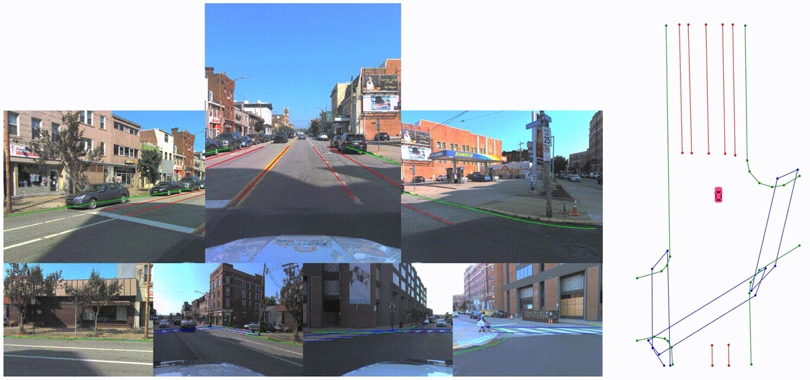
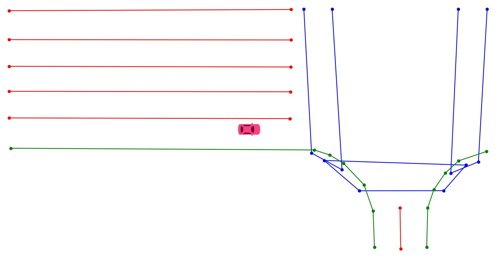

<div id="top" align="center">

# Online HD Map Construction Challenge For Autonomous Driving
 
**[CVPR 2023 Workshop on End-to-End Autonomous Driving](https://opendrivelab.com/AD23Challenge.html)**



</div>

## Table of Contents
- [Introduction](#introduction)
- [Task](#task)
- [News](#news)
- [Data](#data)
- [Get Started](#get-started)
- [Challenge submission and Leaderboard](#challenge-submission-and-leaderboard)
- [Rules](#rules)
- [Citation](#citation)
- [License](#license)

## Introduction
Constructing HD maps is a central component of autonomous driving. However, traditional mapping pipelines require a vast amount of human efforts in annotating and maintaining the map, which limits its scalability. Online HD map construction task aims to dynamically construct the local semantic map based on onboard sensor observations. Compared to lane detection, our constructed HD map provides more semantics information of multiple categories. Vectorized polyline representation are adopted to deal with complicated and even irregular road structures.

## Task

The goal of **Online HD Map Construction Task** is to construct the local HD map from onboard sensor observations (surrounding cameras images). A local HD map can be described by a set of map elements with different categories, e.g. road divider, road boundary and pedestrian crossing. Each map element can be vectorized to a polyline, which is consists of a set of points. Here is an example from topdown view.

<div id="top" align="center">



</div>


We use Chamfer Distance based Average Precision ( $\mathrm{AP}_\mathrm{CD}$ ) as metric to evaluate the quality of construction as introduced in [HDMapNet](https://arxiv.org/abs/2107.06307) and [VectorMapNet](https://arxiv.org/abs/2206.08920). For more details of evaluation metrics, please see [metrics.md](./resources/docs/metrics.md).

## News

- [2023/01]
  - [Benchmark](https://github.com/Tsinghua-MARS-Lab/Online_Map_Construction_Benchmark) on [nuScenes](www.nuscenes.org) dataset released.

## Data

Our dataset is built on top of the [Argoverse2](https://www.argoverse.org/av2.html) dataset. To download the dataset and check more details, please see [data.md](./resources/docs/data.md).

## Get Started

Please refer to [get_started.md](./resources/docs/get_started.md).

## Challenge submission and Leaderboard

Please submit at [EvalAI](https://eval.ai/web/challenges/challenge-page/1954/submission). For details of submission file format, please see [metric.md](./resources/docs/metrics.md).

| Method | $\mathrm{mAP}$ | $\mathrm{AP}_{pc}$ | $\mathrm{AP}_{div}$ | $\mathrm{AP}_{bound}$ |
| :----: | :-: | :-------: | :-----: | :------: |
| VectorMapNet (baseline)      | 42.79   | 37.22         | 50.47       | 40.68        |


## Rules
- During inference, the input modality of the model should be camera only.
- No future frame is allowed during inference.
- In order to check for compliance, we will ask the participants to provide technical reports to the challenge committee and participants will be asked to provide a public talk about their works after winning the award.

## Citation

The evaluation metrics of this challenge follows [HDMapNet](https://arxiv.org/abs/2107.06307). We provide [VectorMapNet](https://arxiv.org/abs/2206.08920) as the baseline. Please cite:

```
@article{li2021hdmapnet,
    title={HDMapNet: An Online HD Map Construction and Evaluation Framework},
    author={Qi Li and Yue Wang and Yilun Wang and Hang Zhao},
    journal={arXiv preprint arXiv:2107.06307},
    year={2021}
}
```

Our dataset is built on top of the [Argoverse 2](https://www.argoverse.org/av2.html) dataset. Please also cite:

```
@INPROCEEDINGS {Argoverse2,
  author = {Benjamin Wilson and William Qi and Tanmay Agarwal and John Lambert and Jagjeet Singh and Siddhesh Khandelwal and Bowen Pan and Ratnesh Kumar and Andrew Hartnett and Jhony Kaesemodel Pontes and Deva Ramanan and Peter Carr and James Hays},
  title = {Argoverse 2: Next Generation Datasets for Self-driving Perception and Forecasting},
  booktitle = {Proceedings of the Neural Information Processing Systems Track on Datasets and Benchmarks (NeurIPS Datasets and Benchmarks 2021)},
  year = {2021}
}
```


## License

Before participating in our challenge, you should register on the website and agree to the terms of use of the [Argoverse 2](https://www.argoverse.org/av2.html) dataset.
All code in this project is released under [GNU General Public License v3.0](./LICENSE).
