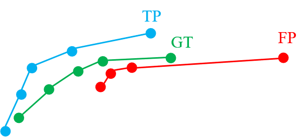

# Metrics & Submission Format

This page describes the evaluation metrics and the submission file format used by this challenge. Currently, three types of map elements are evaluated, including pedestrian crossing, lane divider and road boundary.


## Output

The final output for each input sample is a set of polylines, which is similar to a set of bounding boxes in object detection. Each line consists of a set of points. A line is also categorized by a class label and a confidence score.

## Metrics

We use Chamfer Distance based Average Precision (AP) to characterize the performance of models on vectorized map construction. Matching between predicted lines and ground-truth lines are based on their spatial distance, which is measured by Chamfer Distance (CD). Here is an example of this matching process.

<div id="1" align="center">
  
</div>
<br>

For two lines $L_1$ and $L_2$, two set of points $S_1$ and $S_2$ are sampled from them, respectively. The CD are calculated as follows. 

$$
\mathrm{CD}_{dir}(S_1, S_2)=\frac{1}{|S_1|}\sum_{x\in S_1}\min_{y\in S_2}\Vert x-y\Vert_2
$$

$$
\mathrm{CD}(S_1, S_2)=\frac{1}{2}\mathrm{CD}_{dir}(S_1, S_2)+\frac{1}{2}\mathrm{CD}_{dir}(S_2+S_1)
$$

Note:

1. The direction of lines and the order of points do not matter.
2. The points sampling will be done by evaluation code.
3. The Chamfer Distance is calculated in 2D space. The z-axis (height) will be ignored.

Then Average Precision (AP) is calculated according to the matching results. This calculation is as same as the one used in object detection.

$$
\mathrm{AP}=\sum_{r\in [0, 1]}{\mathrm{Pr}_r}
$$

where $\mathrm{Pr_r}$ is the precision when recall is at $r$.


## Submission Format

Format for submission file

```
submisson_vector {
    "meta": {
        "use_external": <bool>,                     -- Whether this submission uses external data as an input.
        "output_format": "vector",                  -- This submission uses vectorized format.
        ...                                         -- Other meta info you want to add.
    },
    "results": {
        token <str>: {                              -- Maps each predictions by tokens (timestamps).
        "vectors":  list[Array<float, (N, 2)>],   -- list of lines, each line is an array of points.
        "scores":   list[float],                  -- list of scores for lines.
        "labels":   list[int],                    -- list of labels.
        }
    }
}
```
